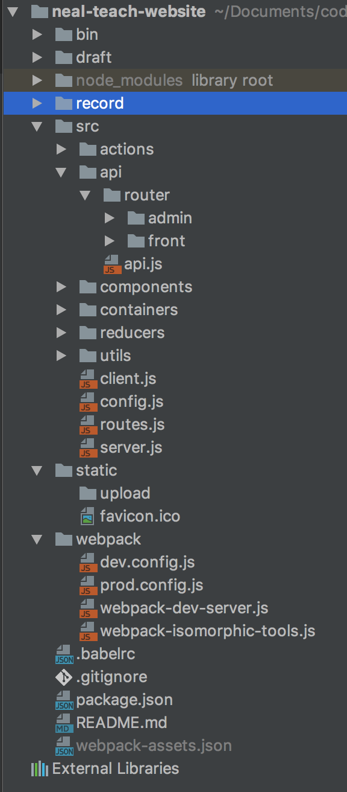

# 网站代码架构记录1.0

## 所需技术
react、es6、webpack、babel、react-redux、redux、react-router、nodejs...
## 说明
参考的一位大神的项目架构+自己的修改。许多还是不够完善，欢迎多多指点。

也是在上面开发了一段时间才整理分享出，感觉分工还不是很明确，还是有许多需要晚上的地方。

先记录着。

---
欢迎学习交流： 
Node.js技术交流群：209530601  
React技术栈：398240621

---

## 整体说明
一个网站的应用，服务器开发阶段分为三个：发送页面服务器，API服务器，资源服务器。生产环境服务器分为页面服务器和API服务器。

## 项目架构如图

OK，这里简单说明下
>bin:启动目录

>draft：理解为草稿文件夹吧

>record：网站开发的过程记录

>src：源码文件
>>actions：前端文件的action api：后端API处理 components ...都是redux相关的配置了

>static：资源文件，
>>upload:上传来的文件

>webpack：webpack的配置文件

下面一个一个的介绍

## 同构配置文件：webpack-isomorphic-tools.js
    var WebpackIsomorphicToolsPlugin = require('webpack-isomorphic-tools/plugin');
    
    var config = {
        assets: {
            images: {extensions: ['png']},
            style_modules: {
                extensions: ['css', 'scss'],
                filter: function (module, regex, options, log) {
                    if (options.development) {
                        return WebpackIsomorphicToolsPlugin.style_loader_filter(module, regex, options, log);
                    } else {
                        return regex.test(module.name);
                    }
                },
                path: function (module, options, log) {
                    if (options.development) {
                        return WebpackIsomorphicToolsPlugin.style_loader_path_extractor(module, options, log);
                    } else {
                        return module.name;
                    }
                },
                parser: function (module, options, log) {
                    if (options.development) {
                        return WebpackIsomorphicToolsPlugin.css_modules_loader_parser(module, options, log);
                    } else {
                        return module.source;
                    }
                }
            }
        }
    };
    
    module.exports = config;

因为需要用到Universal渲染，所以需要同构一下require的能力，这里配置很简单，但是这里对options.development判断了环境

如果是开发环境，则返回适用于style-loader,css-loader的返回值，如果是在生产环境中，则提取单独的样式文件，所以就让他直接返回默认值。
## 项目配置文件：src/config.js
    module.exports = {
        host:process.env.HOST || 'localhost',
        port:process.env.PORT || (process.env.NODE_ENV === 'production'?8080:3000),
        apiHost:process.env.APIHOST || 'localhost',
        apiPort:process.env.APIPORT || '3030',
        app:{
            title:'Neal\'s personal tech-website',
            description:'Neal\' s personal website about technology',
            head:{
                titleTemplate:'Neal\'s personal website',
                meta:[
                    {
                        name:'description',
                        content:'Neal\' s personal website about technology'
                    },
                    {charset:'utf-8'}
                ]
            }
        }
    };

对于端口什么的经常变动就经常使用的变量，我们这里单独的提取出来了。并且配置了默认的HTML页面header信息

## 开发服务器
### 开发环境下的webpack配置：dev.cofig.js
    var path = require('path');
    var webpack = require('webpack');
    var autoprefixer = require('autoprefixer');
    
    var WebpackIsomorphicToolsPlugin = require('webpack-isomorphic-tools/plugin');
    
    var projectRootPath = path.resolve(__dirname, '../');
    var assetsPath = path.resolve(projectRootPath, './static/dist');
    
    var config = require('../src/config');
    
    module.exports = {
        devtool: 'cheap-eval-source-map',
        context: projectRootPath,
        entry: [
            'webpack-hot-middleware/client?path=http://localhost:3001/__webpack_hmr',
            './src/client'
        ],
        output: {
            path: assetsPath,
            filename: '[name]-[hash].js',
            chunkFilename: '[name]-[chunkhash].js',
            publicPath: 'http://' + config.host + ':' + (config.port + 1) + '/dist/'
        },
        progress: true,
        plugins: [
            new webpack.optimize.OccurrenceOrderPlugin(),
            new webpack.HotModuleReplacementPlugin(),
            new webpack.DefinePlugin({
                __SERVER__: false
            }),
            new WebpackIsomorphicToolsPlugin(require('./webpack-isomorphic-tools')).development(),
            new webpack.ProvidePlugin({
                $:'jquery',
                jQuery:'jquery',
                "window.jQuery":"jquery"
            })
        ],
        module: {
            loaders: [
                {
                    test: /\.js$/,
                    loader: 'babel',
                    exclude: /node_modules/,
                    query: {
                        presets: ['react-hmre']
                    }
                },
                { test: /\.(jpeg|jpg|png|gif)$/, loader: 'url-loader?limit=10240' },
                {
                    test: /\.css$/,
                    loaders: [
                        'style',
                        'css?modules&importLoaders=1&localIdentName=[name]__[local]__[hash:base64:5]',
                        'postcss'
                    ]
                },
                {
                    test: /\.scss$/,
                    loaders: [
                        'style',
                        'css?modules&importLoaders=2&localIdentName=[name]__[local]__[hash:base64:5]',
                        'postcss',
                        'sass'
                    ]
                }
            ]
        },
        postcss: [autoprefixer({ browsers: ['last 2 versions'] })]
    };

这里的devtool选用cheap-module-eval-source-map,毕竟可以在代码映射的时候点击直接跳转到源码。

别的一般都是常规配置。

### 资源服务器 webpack-dev-server.js
    var Express = require('express');
    
    var webpack = require('webpack');
    var webpackDevMiddleware = require('webpack-dev-middleware');
    var webpackHotMiddleware = require('webpack-hot-middleware');
    var webpackConfig = require('./dev.config');
    
    var app = new Express();
    var port = require('../src/config').port + 1;
    
    var compiler = webpack(webpackConfig);
    app.use(webpackDevMiddleware(compiler, {noInfo: true, publicPath: webpackConfig.output.publicPath}));
    app.use(webpackHotMiddleware(compiler));
    
    app.listen(port, (error) => {
        if (error) {
            console.error(error)
        } else {
            console.info(`==> 🚧  Webpack development server listening on port ${port}.`)
        }
    });
    
注意这里的端口配置和上面的webpack配置文件的热更新配置是一致的。
    
启动资源服务器：

    "watch-client": "node webpack/webpack-dev-server"
    
## 前端页面服务器
    
    import path from 'path'
    import Express from 'express'
    import favicon from 'serve-favicon'
    import httpProxy from 'http-proxy'
    import compression from 'compression'
    import React from 'react'
    import {renderToString} from 'react-dom/server'
    import {Provider} from 'react-redux'
    import {match,RouterContext} from 'react-router'
    import configStore from './utils/configureStore'
    import getRoutes from './routes'
    import Html from './utils/Html'
    import config from './config'
    import cookieParser from 'cookie-parser'
    import cookieSession from 'cookie-session'
    
    const app = new Express();
    const port = config.port;
    const targetUrl = `http://${config.apiHost}:${config.apiPort}`;
    const proxy = httpProxy.createProxyServer({
        target:targetUrl
    });
    
    app.use(cookieParser('Neal_signed'));
    {
        let arr = [];
        for(let i = 0;i<10000;i++){
            arr.push('keys_'+Math.random());
        }
        app.use(cookieSession({
            keys:arr,
            name:'session_id',
            maxAge:24*60*60*1000//one day
        }));
    }
    
    app.use(compression());
    app.use(Express.static(path.join(__dirname,'..','static')));
    app.use(favicon(path.join(__dirname,'..','static','favicon.ico')));
    
    app.use('/api',(req,res)=>{
        proxy.web(req,res,{target:targetUrl})
    });
    
    app.use((req,res)=>{
    
        global.__COOKIE__ = req.get('cookie');
    
        if(process.env.NODE_ENV !== 'production'){
            webpackIsomorphicTools.refresh()
        }
    
        const store = configStore();
        const routes = getRoutes(store);
        
        function hybrateOnClient() {
            res.send('<!doctype html>\n'+
            renderToString(<Html assets={webpackIsomorphicTools.assets()} store={store}/>))
        }
    
        if(__DISABLE_SSR__){//禁止universal渲染
           hybrateOnClient();
           return;
        }
    
        match({routes,location:req.url},(err,redirect,renderProps)=>{
            if(err){
                res.status(500);
                hybrateOnClient();
                console.error('ROUTER ERROR:', err.stack);
            }else if(redirect){
                res.redirect(redirect.pathname + redirect.search);
            }else if(renderProps){
                res.status(200);
                const component = (
                    <Provider store={store}>
                        <RouterContext {...renderProps}/>
                    </Provider>
                );
                res.send('<!doctype html>\n'+
                renderToString(<Html store={store} assets={webpackIsomorphicTools.assets()} component={component}/>));
    
            }else{
                res.status(404).send('Not found');
            }
        });
    });
    
    app.listen(port, (error) => {
        if (error) {
            console.error(error);
        } else {
            console.info('==> 🌎  Open http://%s:%s in a browser to view the app.', config.host, port);
        }
    });

前端服务器的作用就是吐页面的。

这里我们使用server-favicon,compression分别处理收藏的小图标以及启动压缩。

http-proxy：将API服务器代理到前端服务器上，主要用于解决跨域的问题，转发了所有的请求代理到真实的后端ip地址。实现正真的前后端分离。其实说到这里，我也渐渐地分不清前后端了。

这里还对是否需要进行Universal渲染加了一层判断，然后如果是开发环境，我们还需要对所有的资源文件缓存进行清除，让热更新功能生效。

其中webpackIsomorphicTools.assets()其实就是webpack-assets.json文件的内容

这里我们将HTML字符串但是抽到一个组件上来，用于实现Universal的渲染

## 使用组件渲染HTML页面

    import React, { PropTypes } from 'react';
    import ReactDOM from 'react-dom/server';
    import serialize from 'serialize-javascript';
    import Helmet from 'react-helmet';
    
    function Html(props) {
        const { assets, component, store } = props;
        const content = component ? ReactDOM.renderToString(component) : '';
        const head = Helmet.rewind();
        return (
            <html lang="zh-CN">
            <head>
                {head.base.toComponent()}
                {head.title.toComponent()}
                {head.meta.toComponent()}
                {head.link.toComponent()}
                {head.script.toComponent()}
    
                <link rel="shortcut icon" href="/favicon.ico" />
                <meta name="viewport" content="width=device-width, initial-scale=1" />
                {Object.keys(assets.styles).map((style, key) =>
                    <link
                        href={assets.styles[style]} key={key} media="screen, projection"
                        rel="stylesheet" type="text/css"
                        charSet="UTF-8"
                    />
                )}
            </head>
            <body>
            

            <script
                dangerouslySetInnerHTML={{
                    __html: `window.__INITIAL_STATE__=${serialize(store.getState())};`
                }}
                charSet="UTF-8"
            />
            <script src={assets.javascript.main} charSet="UTF-8" />
            </body>
            </html>
        );
    }
    
    Html.propTypes = {
        assets: PropTypes.object,
        component: PropTypes.node,
        store: PropTypes.object
    };
    
    export default Html;

这里我们使用react-helmet来组织文档的头部。输出纯HTML标签

接受Webpack同构工具提供的kv对象，React组件component以及redux的store作为props

在遍历同构工具的kv对象给HTML添加独立出来的样式的时候，只有在生产环境下assets.styles才是有值得。开发环境中，这些都是在缓存中的

由于react会对HTML进行编码来防止xss攻击，所以要想渲染HTML字符串，应该使用dangerouslySetInnerHTML。

由于前端页面服务器开发环境下和生产环境下需求是不同的，所以这里我们需要单独的写一个文件来启动开发服务器

## 启动前端服务器

    const path = require('path');
    const rootDir = path.resolve(__dirname,'..');
    
    var WebpackIsomorphicTools = require('webpack-isomorphic-tools');
    
    global.__SERVER__ = true;
    global.__DISABLE_SSR__ = false;
    global.__COOKIE__ = null;
    if(process.env.NODE_ENV === 'production'){
        global.webpackIsomorphicTools = new WebpackIsomorphicTools(require('../webpack/webpack-isomorphic-tools'))
            .server(rootDir,function () {
                require('../build/server')
            });
    }else{
        require('babel-register');
        global.webpackIsomorphicTools = new WebpackIsomorphicTools(require('../webpack/webpack-isomorphic-tools'))
            .development()
            .server(rootDir,function () {
                require('../src/server');
            });
    }
    
注意这里的对同构工具分别加入的.development()以及在开发环境中使用babel钩子：babel-register

然后启动命令：

    "start-prod": "cross-env NODE_ENV=production node bin/server",
    "start-dev": "nodemon --watch src bin/server.js"
    
由于windows不支持NODE_ENV...所以这里使用一个第三方插件cross-env，然后使用nodemon代替node，是为了在每一次修改完代码不需要手动重启服务器了。提高开发效率

## API服务器
其实就是所谓的真正的后端

    import Express from 'express'
    import config from '../config'
    import bodyParser from 'body-parser'
    import multer from 'multer'
    const multerObj = multer({dest:'../../static/upload'});
    import cookieParser from 'cookie-parser'
    import cookieSession from 'express-session'
    
    const port  = config.apiPort;
    const app = new Express();
    
    //处理请求数据
    app.use(bodyParser({
        extended:false
    }));
    app.use(multerObj.any());
    
    //cookie session
    app.use(cookieParser('Neal_signed'));
    app.use(cookieSession({
        secret:'Neal_signed',
        resave:true,
        saveUninitialized:true,
        cookie:{maxAge:60*60*1000}
    }));
    
    //设置路由
    app.use('/admin',require('./router/admin')());
    app.use('/',require('./router/front')());
    
    
    app.listen(port, (error) => {
        if (error) {
            console.error(error);
        } else {
            console.info('==> 🌎  API Listening on port %s. ', port);
        }
    });
    
## 启动API服务器：

    if(process.env.NODE_ENV==='production'){
        require('../build/api/api');
    }else{
        require('babel-register');
        require('../src/api/api');
    }
    
启动命令：

    "start-api-dev": "nodemon --watch src/api  bin/api.js",
    "start-api-prod": "cross-env NODE_ENV=production node bin/api.js"
    
使用nodemon监控src/api文件的变化，然后启动bin/api.js注意这里的js不能省略。

## 生产环境下运行nodejs
启动命令：

    "clean": "rimraf build static/dist",
    "start-prod": "cross-env NODE_ENV=production node bin/server",
    "start-api-prod": "cross-env NODE_ENV=production node bin/api.js"

## 生产环境下的编译和配置：

    const path = require('path');
    const webpack = require('webpack');
    const WebpackIsomorphicTools = require('webpack-isomorphic-tools/plugin');
    const ExtractTextPlugin = require('extract-text-webpack-plugin');
    const autoprefixer = require('autoprefixer');
    
    const projectRootPath = path.resolve(__dirname, '..');
    const assetsPath = path.resolve(projectRootPath, './static/dist');
    
    module.exports = {
        devtool: 'source-map',
        context:projectRootPath,
        entry:[
            './build/client'
        ],
        output:{
            path:assetsPath,
            filename:'[name]-[chunkhash].js',
            chunkFilename:'[name]-[chunkhash].js',
            publicPath:'/dist/'
        },
        progress:true,
        plugins:[
            new ExtractTextPlugin('[name]-[chunkhash].css', { allChunks: true }),
            new webpack.optimize.DedupePlugin(),//去重
            new webpack.optimize.OccurrenceOrderPlugin(),
            new webpack.optimize.UglifyJsPlugin({
                compress:{
                    warnings:false
                },
                except: ['$super', '$', 'exports', 'require','import']
            }),
            new WebpackIsomorphicTools(require('./webpack-isomorphic-tools')),
            new webpack.DefinePlugin({
                'process.env': {
                    NODE_ENV: '"production"'
                },
                __SERVER__: false
            }),
            new webpack.ProvidePlugin({
                $:'jquery',
                jQuery:'jquery',
                "window.jQuery":"jquery"
            })
        ],
        module:{
            loaders:[
                { test: /\.(jpeg|jpg|png|gif)$/, loader: 'url-loader?limit=10240' },
                {
                    test: /\.css$/,
                    loader: ExtractTextPlugin.extract(
                        'style',
                        'css?modules&importLoaders=1&localIdentName=[name]__[local]__[hash:base64:5]' +
                        '!postcss'
                    )
                },
                {
                    test: /\.scss$/,
                    loader: ExtractTextPlugin.extract(
                        'style',
                        'css?modules&importLoaders=2&localIdentName=[name]__[local]__[hash:base64:5]' +
                        '!postcss' +
                        '!sass'
                    )
                },
            ]
        },
        postcss: [autoprefixer({ browsers: ['last 2 versions'] })]

    
这里我们devtool：设置为source-map,因为这种模式的构建速度非常的快，虽然没有源码的映射

新增ExtractTextPlugin用来提取样式文件，DedupePugin和UglifyJsPlugin用于去重和压缩，应为我们统一用babel进行了编译处理，所以加载器里就不需要对JavaScript的es6语法单独处理了

启动命令：

    "dev": "concurrently -k \"npm run watch-client\" \"npm run start-api-dev\" \"npm run start-dev\"",
    "prod": "npm run build && concurrently -k \"npm run start-api-prod\" \"npm run start-prod\"",
    
这里concurrently，命令平行启动，注意使用引号单独的隔开每一个命令，否则会每一个单词独立运行

## 最后
整体的架构大概就是如此，初次意外还有在utils文件夹下的一些工具文件，当然，这些我们完全可以自定义。

## 缺陷

目前只是第一版本，后续可能随着项目经验的累积会再对这些架构的重构，还有版本用的不是最新的版本，比如webpack用的还是1.0的版本，后续都会再优化改进。

也希望广度网友多多提提意见，共同学习共同进步。